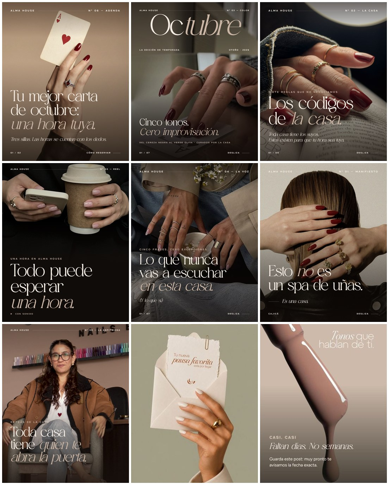
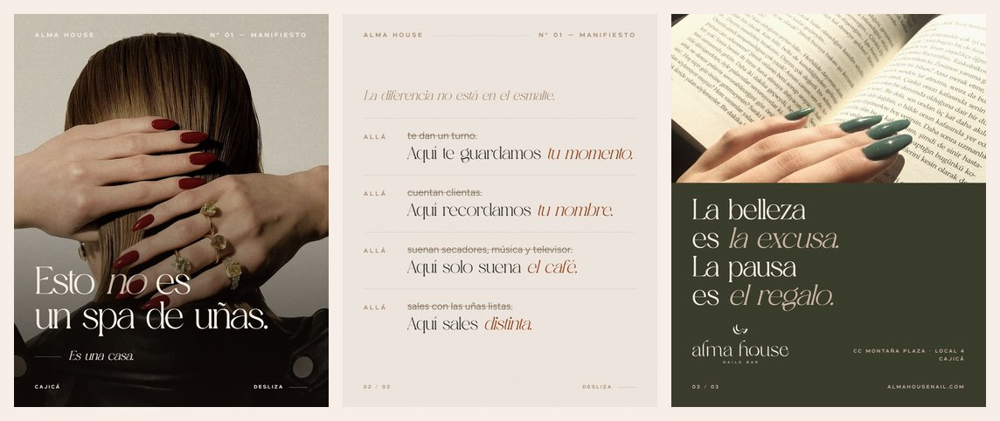
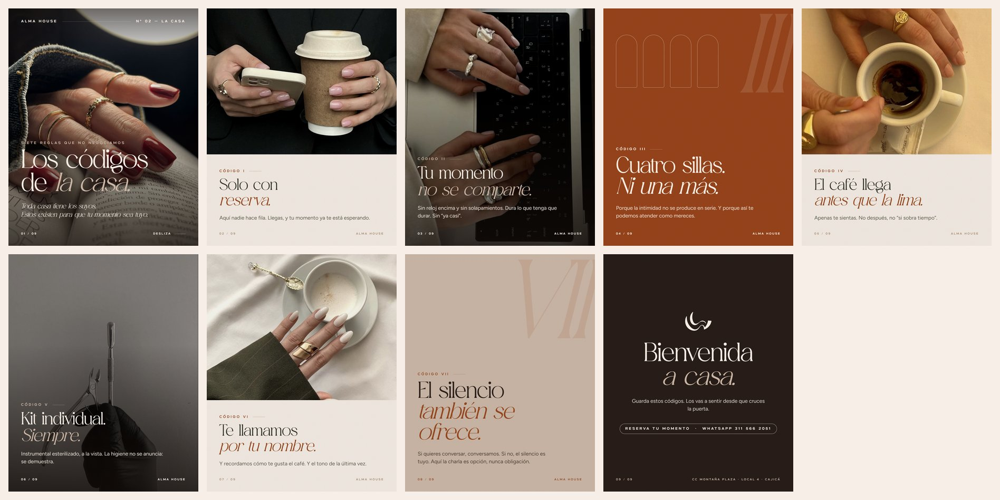
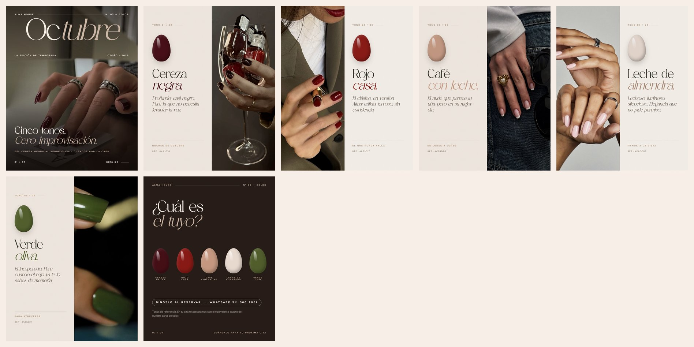
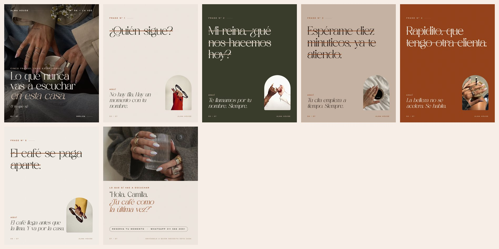
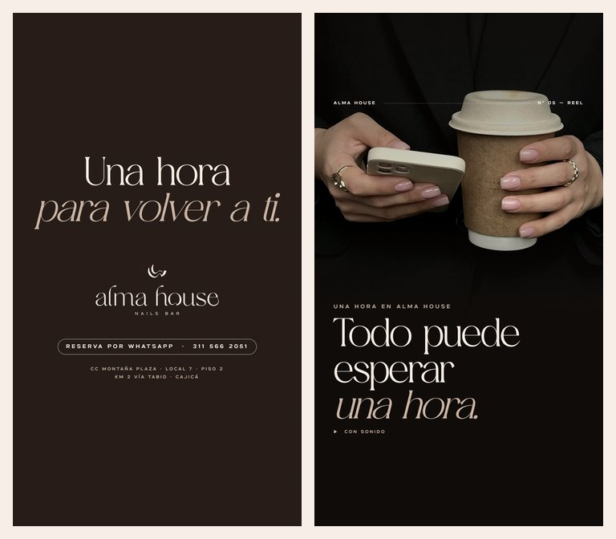
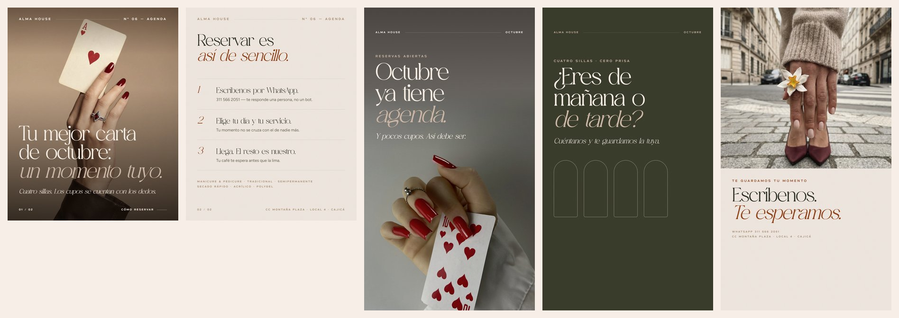
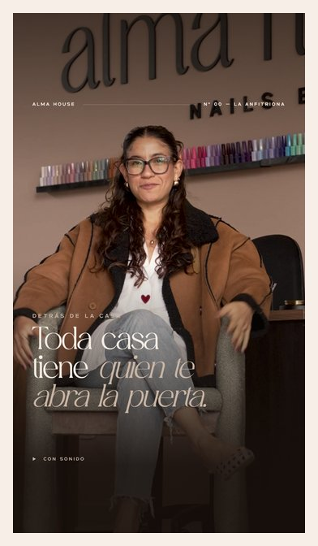

# Alma House · Capítulo III — *La Casa*

**Contenidos de cierre de septiembre 2026 · Instagram**
Por **We Rock Agencia** para Alma House Nails Bar (Cajicá).

**Página de revisión (captions con botón copiar, carruseles, video):** https://werockagencia.github.io/alma-house-contenidos-septiembre/
**Todos los captions en un documento:** [CAPTIONS.md](CAPTIONS.md)



---

## La idea

La marca ya contó dos capítulos:

| Capítulo | Qué dijo | Piezas |
|---|---|---|
| I · Expectativa | *"Algo está por llegar."* | Anuncio, revelación, concepto, espacio, cuenta regresiva, invitación |
| II · Apertura | *"No vendemos manicure. Vendemos tiempo."* | 5 reels: el diagnóstico, el ritual, el umbral, lo que incluye tu hora, reserva ya |
| **III · La Casa** | **"Esto no es un spa de uñas. Es una casa. Y toda casa tiene sus códigos."** | **Estas 7 piezas** (Nº 00–06) |

Ya abrimos la puerta. Ahora mostramos cómo se vive adentro. El capítulo III deja de *prometer* una experiencia y empieza a *demostrarla* con reglas concretas, una voz propia y curaduría. Así se construye lo exclusivo: no diciendo "somos exclusivas", sino con tres sillas, una hora bloqueada por clienta y un café que llega antes que la lima.

Todo el discurso sale del ADN de marca (Studio Ecoartes). Nada es inventado: cada código, cada frase y cada respuesta tiene su origen en el documento (3.1, 3.3, 3.8, 3.9).

**Dirección visual:** el tablero de Pinterest de la cliente pedía otra cosa que el feed pastel del manual: **editorial de moda, quiet luxury.** Manos con anillos dorados, rojos cereza y vino, café, libros, cartas, blazers y denim. Se tradujo a un sistema de revista: numeración de edición (Nº 00–06), masthead, folios, hairlines, tipografía monumental y grano de película. Así el feed se lee como una publicación, no como un catálogo de servicios.

---

## Las 7 piezas

| Fecha | # | Pieza | Formato | Para qué |
|---|---|---|---|---|
| Vie 25 sep · 7:00 p. m. | 00 | [**Reel — La anfitriona**](piezas/00-reel-la-anfitriona/copy.md) | Reel 35 s (video final `Contenidos/03.mp4`) + portada | Prólogo: la marca tiene cara y se ve el local real. Confianza antes que concepto. |
| Sáb 26 sep · 10:00 a. m. | 01 | [**Manifiesto** — *Esto no es un spa de uñas*](piezas/01-manifiesto/copy.md) | Carrusel 3 | Rompe la categoría. Fijar en el perfil. |
| Dom 27 sep · 6:00 p. m. | 04 | [**Lo que nunca vas a escuchar en esta casa**](piezas/04-frases-que-no-escucharas/copy.md) | Carrusel 7 | Voz de marca con humor fino. El más compartible. |
| Lun 28 sep · 7:00 a. m. | 05 | [**Reel — Todo puede esperar una hora. Tú no.**](piezas/05-reel-todo-puede-esperar/copy.md) | Reel 9:16 (kit de edición) | El insight del celular saturado, el día que más duele. |
| Mar 29 sep · 12:30 p. m. | 02 | [**Los códigos de la casa**](piezas/02-codigos-de-la-casa/copy.md) | Carrusel 9 | Demuestra la exclusividad con 7 reglas. El más guardable. |
| Mié 30 sep · 12:30 p. m. | 03 | [**La edición de octubre**](piezas/03-edicion-de-octubre/copy.md) | Carrusel 7 | Curaduría de color como lujo. La pieza más *fashion*. |
| Jue 1 oct · 12:30 p. m. | 06 | [**La agenda de octubre**](piezas/06-agenda-de-octubre/copy.md) | Post 2 + 3 historias | Abre octubre convirtiendo en reservas, con escasez real y sin gritar. |

El número (Nº) es la edición impresa en cada pieza; el orden de publicación es el de la tabla. El calendario vive en [`scripts/plan.mjs`](scripts/plan.mjs) y de ahí salen la página, los previews y CAPTIONS.md.

Cada carpeta trae: `export/` (PNG finales listos para subir), `copy.md` (caption, versión corta para pauta, hashtags, texto alternativo y notas) y `slides.html` (fuente editable).

### Previews por pieza

| | |
|---|---|
|  |  |
|  |  |
|  |  |
|  | |

---

## Sistema visual

| Elemento | Uso |
|---|---|
| **Aurora Magnolia Serif** (tipografía principal oficial) | Titulares monumentales; la *itálica* marca la palabra que importa |
| **Uncage** (tipografía secundaria oficial) | Etiquetas en versalitas con tracking amplio: masthead, folios, códigos |
| **Figtree** | Solo texto de lectura pequeño |
| Paleta oficial | White Beach `#F7EFE7` · Smoke Dragon `#CEBAAA` · Edamame `#A3A287` · Hot Brown `#99471D` · Bakery Brown `#AF9175` + neutros de soporte forest `#3F412F` y espresso `#2A1F1A` |
| Fotografía | Tablero de Pinterest de la cliente, con una gradación cálida común (`sepia` + contraste) para que fotos de fuentes distintas se lean como una sola sesión |
| Textura | Grano de película sutil sobre todo el lienzo |
| Firma editorial | Masthead *Alma House — Nº XX*, folio *01 / 09*, hairlines, "Desliza" |

Todos los estilos viven en [`assets/css/alma.css`](assets/css/alma.css). Los logos son los oficiales del manual, recortados automáticamente.

---

## Antes de publicar: validar con la cliente

Son afirmaciones que vienen del ADN de marca. Hay que confirmar que la operación real hoy las cumple; si alguna cambió, se ajusta el slide antes de publicar:

- [ ] **Máximo 3 sillas** (piezas 02, 06)
- [ ] **Atención 100% con reserva** y **hora completa bloqueada por clienta** (02, 04, 06)
- [ ] **Café incluido** en la experiencia (02, 04). Si tiene costo, en `04/copy.md` está la frase de reemplazo
- [ ] **Kit individual e instrumental esterilizado a la vista** (02)
- [ ] **Nombre de la fundadora** para el caption del reel Nº 00
- [ ] **Carta de color** con equivalentes para los 5 tonos de octubre (03)
- [ ] Handle de Instagram definitivo, para mencionarlo en captions si se quiere (en las piezas se usa solo `almahousenail.com` y el WhatsApp, que están verificados)

**Nota de derechos sobre las imágenes:** salvo el reel Nº 00 (filmado en el local), las fotos son de terceros, tomadas del tablero de Pinterest aprobado por la cliente (registro en [`assets/pinterest/SOURCES.md`](assets/pinterest/SOURCES.md)). **Uso: contenido orgánico, no pauta.** Si una pieza pasa a pauta paga, se reemplaza la foto por una sesión propia con la misma dirección: basta cambiar el archivo en `assets/photos/` y volver a renderizar.

---

## Editar y volver a exportar

Requiere Node 18+ y Google Chrome (o Edge) instalado.

```bash
npm install
npm run build        # prepara assets + exporta piezas + previews + página
npm run site         # regenera index.html, web/ y CAPTIONS.md
npm run render -- 03 # re-exporta solo la pieza 03
npm run preview      # regenera preview/
```

- Cambiar un texto: editar `piezas/<pieza>/slides.html` y correr `npm run render -- <nº>`.
- Cambiar una foto: reemplazar el archivo en `assets/photos/` (mismo nombre) o mapear otro pin en `scripts/prep-assets.mjs`.
- Cada `<section class="slide" data-file="…">` es un PNG. Con `data-transparent` se exporta con fondo transparente (así están hechos los textos del reel).

```
piezas/
  00-reel-la-anfitriona/   copy.md · portada · video/ (versión web liviana)
  01-manifiesto/           slides.html · copy.md · export/*.png
  02-codigos-de-la-casa/
  03-edicion-de-octubre/
  04-frases-que-no-escucharas/
  05-reel-todo-puede-esperar/   (portada, 6 textos PNG transparentes, placa de cierre)
  06-agenda-de-octubre/         (post ×2 + historias ×3)
assets/
  css/alma.css             sistema de diseño
  brand/                   fuentes y logos oficiales
  photos/                  fotos seleccionadas y optimizadas
  pinterest/               los 56 pines originales del tablero + SOURCES.md
scripts/                   plan (calendario) · prep-assets · render · preview · site
preview/                   grid del feed + hojas de contacto
web/ · index.html          página de revisión (GitHub Pages)
CAPTIONS.md                todos los captions en orden de publicación
```

---

**Datos de contacto usados en las piezas:** WhatsApp +57 311 566 2051 · CC Montaña Plaza, local 7, piso 2 (Km 2 vía Tabio), Cajicá · almahousenail.com
